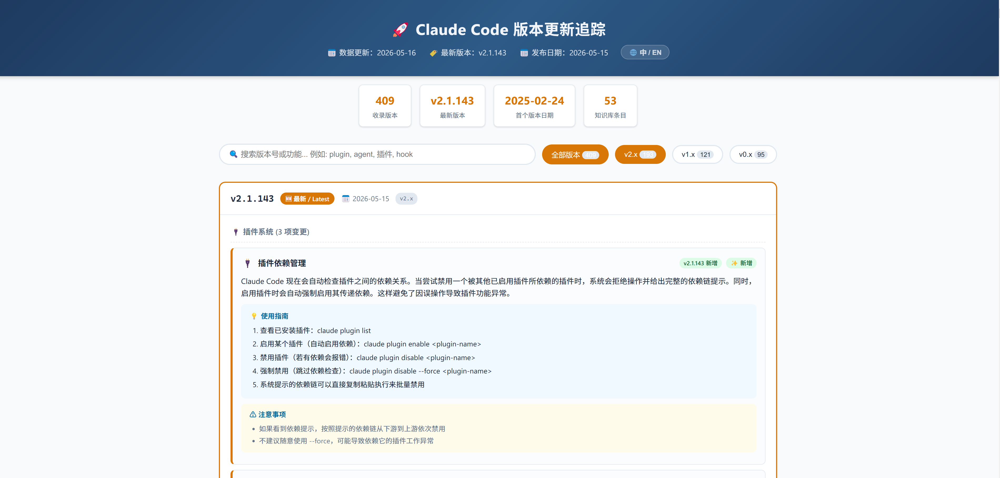

# 🚀 What Claude Update — Claude Code Version Tracker

> One-click tool to track every Claude Code CLI version update — with detailed Chinese usage guides and examples.

[](LICENSE)
[](https://nodejs.org)
[🌐 中文版](README_CN.md)

## 📖 Overview

**What Claude Update** is a zero-dependency version tracking tool. Double-click `update.bat` and it automatically fetches all Claude Code CLI release notes from the internet, generating a beautifully structured HTML page. Each feature includes **Chinese explanations, usage guides, and practical examples** — so you never miss a new capability.



## ✨ Features

| Feature | Description |
|---------|-------------|
| 🔄 **One-Click Update** | Double-click `update.bat` — fetches latest data and opens in browser |
| 📦 **Incremental Sync** | Cached versions are kept forever; only new versions are fetched each run |
| 🌐 **Bilingual UI** | Toggle between Chinese (with original usage guides) and English (raw release notes) |
| 🃏 **Feature Cards** | Each feature gets a dedicated card, grouped by category (Plugins, Agent, CLI, Worktree...) |
| 💡 **Usage Examples** | Each of 2100+ features includes AI-generated usage steps and practical tips |
| 🔍 **Smart Search** | Real-time filtering by version number or feature name; filter by major version |
| 🎨 **Dark Mode** | Auto-follows system light/dark theme |
| ⚡ **Zero Dependencies** | Uses only Node.js built-in modules — no `npm install` needed |

## 🚀 Quick Start

### Prerequisites

- **Node.js >= 18** (built-in `fetch` support)
- **Network connection** (accesses npm registry and GitHub API on first run)

### Install & Run

```bash
# 1. Clone the repo
git clone https://github.com/jovetickop/what-claude-update.git
cd what-claude-update

# 2. Double-click
update.bat

# Or run via command line
node generate.js
```

First run takes ~15 seconds (fetches 409 versions + 112 release notes). Subsequent runs take ~3 seconds (incremental check only).

### Output Structure

```
what-claude-update/
├── update.bat              # Entry point (double-click) — fetch versions + generate HTML
├── enrich-kb.bat           # AI-powered knowledge base enricher (double-click)
├── enrich-kb.js            # Calls local Claude CLI to generate real usage guides
├── generate.js             # Core script
├── claude-versions.html    # ← Generated output (open in browser)
├── data/
│   ├── kb.json             # Knowledge base (2100+ features with Chinese guides)
│   └── versions-cache.json # Version cache (incremental update base)
└── README.md
```

## 📊 Data Sources

| Source | What It Provides | Refresh |
|--------|-----------------|---------|
| [npm registry](https://www.npmjs.com/package/@anthropic-ai/claude-code) | 409 version numbers + release dates | Every run |
| [GitHub Releases](https://github.com/anthropics/claude-code/releases) | Detailed changelogs for 112 versions | When new versions detected |
| Local `kb.json` | 2100+ feature descriptions in Chinese with AI-generated usage guides | Auto-enriched via `enrich-kb.bat` |

## 🔧 Knowledge Base Contributions

`data/kb.json` is the feature knowledge base. Each entry follows this structure:

```json
{
  "plugin-dependency": {
    "titleZh": "插件依赖管理",
    "introducedIn": "2.1.143",
    "category": "插件系统",
    "changeType": "新增",
    "enKeywords": ["plugin dependency", "plugin disable", "transitive dependencies"],
    "descZh": "Claude Code now enforces plugin dependency rules...",
    "usageSteps": [
      "List plugins: claude plugin list",
      "Enable plugin: claude plugin enable <plugin-name>"
    ],
    "tips": ["Plugins depended on by others cannot be disabled directly"]
  }
}
```

### Auto-Enrich with AI

Run `enrich-kb.bat` to call your local Claude CLI and generate real, specific usage steps and tips for every feature entry. This replaces generic placeholder text with actionable guides.

```bash
# Double-click enrich-kb.bat, or:
node enrich-kb.js
```

The script processes entries one by one, saves after each, and can be interrupted/resumed at any time.

### Manual Entries

To add a new entry manually: follow the format above in `kb.json`. The key field is `enKeywords` — these English keywords are used to match against GitHub release notes.

## 📝 Version Coverage

| Major | Count | Date Range |
|-------|-------|------------|
| v2.x | 193 | 2025-12 ~ present |
| v1.x | 121 | 2025-07 ~ 2025-12 |
| v0.x | 95 | 2025-02 ~ 2025-07 |

## 🤝 License

MIT License
